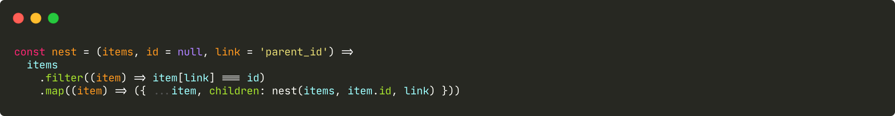

```ts
/**
 * 树状递归
 */
const nest = (items, id = null, link = 'parent_id') =>
  items
    .filter((item) => item[link] === id)
    .map((item) => ({ ...item, children: nest(items, item.id, link) }))
```
